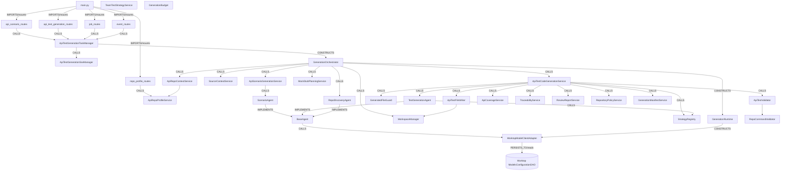

# 01 — Backend Code Dependency Graph (api-agent)

Typed graph of the api-agent backend (`worktop/api_agent/app`). Node/edge legend
in [README](README.md). Root package prefix `worktop.api_agent.app` omitted from
node names for brevity.

## Layered graph



## Typed edges — control plane

| From | Edge | To | Notes |
|---|---|---|---|
| `main.py` | IMPORTS | 5 route modules | FastAPI router mount |
| `api_scenario_routes` | CALLS | `ApiTestGenerationTaskManager` | enqueue scenario job |
| `api_test_generation_routes` | CALLS | `ApiTestGenerationTaskManager` | enqueue code job (`/generate-api-test-code`, `/generateApiTests`) |
| `job_routes` | CALLS | `ApiTestGenerationTaskManager` | get/abort job (+ by-key) |
| `event_routes` | CALLS | `ApiTestGenerationSseManager` + TaskManager | SSE stream |
| `repo_profile_routes` | CALLS | `ApiRepoProfileService` | synchronous profile, bypasses task manager |
| `ApiTestGenerationTaskManager` | CONSTRUCTS | `GenerationOrchestrator` | per task, in `ThreadPoolExecutor` |
| `ApiTestGenerationTaskManager` | DEPENDS_ON | `ThreadPoolExecutor`, `GenerationJob` (in-memory dict) | single-process state |
| `GenerationOrchestrator` | CONSTRUCTS | `GenerationRuntime` | `create(db, tenant_id, repo_path, branch)` |

## Typed edges — generation pipeline

| From | Edge | To |
|---|---|---|
| `GenerationOrchestrator` | CALLS | `ApiRepoContextService`, `SourceContextService`, `MockStubPlanningService`, `WorkspaceManager`, `RepoDiscoveryAgent` |
| `GenerationOrchestrator` | CALLS | `ApiScenarioGenerationService` (scenarios) / `ApiTestCodeGenerationService` (code) |
| `GenerationOrchestrator` | CALLS | `GenerationBudget` (governance guard) |
| `ApiScenarioGenerationService` | CALLS | `ScenarioAgent` (+ scenario guard, `ApiCoverageService`, `ScenarioValueService`) |
| `ApiTestCodeGenerationService` | CALLS | `TestGenerationAgent`, `GeneratedFileGuard`, `ApiTestValidator`, `ApiTestFileWriter`, `StrategyRegistry` |
| `ApiTestCodeGenerationService` | CALLS | `ApiCoverageService`, `TraceabilityService`, `ReviewReportService`, `RepositoryPolicyService`, `GenerationManifestService` |
| `ScenarioAgent` / `TestGenerationAgent` / `RepoDiscoveryAgent` | IMPLEMENTS | `BaseAgent` |
| `TestGenerationAgent` | CALLS | `StrategyRegistry` → `*Strategy` (Java/Python plugins) |
| `RepoDiscoveryAgent` | CALLS | `RepoExplorer` (read_file/search/list_dir loop) |
| `BaseAgent.complete_structured` / `complete_with_exploration` | CALLS | `WorktopModelClientAdapter` |

## Typed edges — scanners (tools) feeding discovery

| From | Edge | To (tools) |
|---|---|---|
| `ApiRepoContextService` | CALLS | `openapi_scanner`, `api_endpoint_scanner`, `existing_test_scanner`, `source_context_tool` |
| `ApiRepoProfileService` | CALLS | `dependency_scanner`, `fixture_scanner`, `mock_stub_scanner`, `command_discovery` |
| `SourceContextService` | CALLS | `source_context_tool`, `file_reader`, `search`, `git` |
| `ApiTestFileWriter` | CALLS | `WorkspaceManager`, `file_writer_tool`, `path_safety` |

## DTO ↔ schema nodes (produced/consumed)

| DTO | Produced by | Consumed by |
|---|---|---|
| `GenerateApiScenariosRequest` / `GenerateApiTestCodeRequest` | routes (ACCEPTS) | orchestrator |
| `ScenarioPlanOutput`, `TestCodeOutput` (`llm_outputs`) | agents (LLM structured output) | services/guards |
| `RepoProfile`, `GenerationSourceContext`, `MockStubPlan` | context/profile/planning services | agents, prompts, review |
| `ApiScenarioGenerationResult`, `ApiTestGenerationResult` | services | task manager → `GenerationJob` |
| `GenerationJob`, `QueuedTask`, `GenerationEvent` | task/SSE managers | routes (RETURNS) |
| `ReviewReport`, `TraceabilityMatrix`, `CoverageReport`, `GenerationManifest` | enterprise services | result DTOs |

## PERSISTS_TO / EXTERNAL edges (the entire DB + host surface)

| From | Edge | To | Purpose |
|---|---|---|---|
| `WorktopModelClientAdapter` | PERSISTS_TO (read) | `ModelsConfigurationDAO(db)` | tenant model config — **only DB access** |
| `WorktopModelClientAdapter` | DEPENDS_ON | `DefaultLLMClient`, `ModelClientFactory`, `CommonUtils` (Worktop) | model client |
| all modules | DEPENDS_ON | `utils/logging_utils` → Worktop custom logger | logging |

No `ENTITY` or `TABLE` nodes are owned by api-agent.

## TESTED_BY edges

| Production area | Edge | Test |
|---|---|---|
| contracts, adapter repair, guards, scenario/code services, discovery, exploration, mock-emission, CI/stage | TESTED_BY | `tests/test_generation_hardening.py` |
| enterprise gaps (coverage, traceability, policy, budget, manifest, governance) | TESTED_BY | `tests/test_enterprise_gaps.py` |
| logging namespace/standard | TESTED_BY | `tests/test_logging_standard.py` |

## Module (build) dependencies

```text
api → task_managers → services → agents → prompts + tools + strategies + validation
services → schemas (shared DTOs)
agents → llm (adapter) → EXTERNAL worktop
all → utils/logging_utils, config, errors
```
