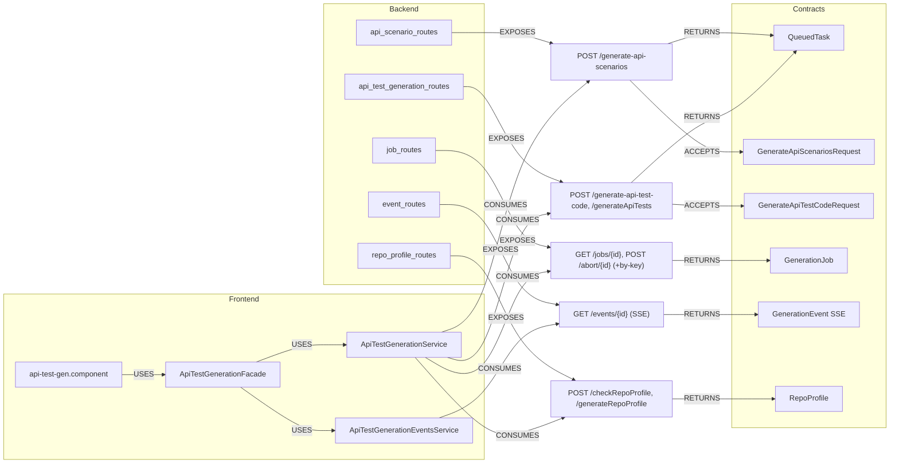

# 02 — Cross-Layer Contract Propagation Graph (api-agent)

The bridge from backend endpoint → contract DTO → frontend service → frontend
model → screen. This is the graph you traverse to answer "if I change this
endpoint/DTO, what breaks?". Scope: the api-agent HTTP + SSE surface
(`/api/api-test-generation`) and its API-tab frontend consumers.

## Endpoint contract table

| Endpoint | Method | ACCEPTS | RETURNS | Frontend consumer |
|---|---|---|---|---|
| `/api/api-test-generation/generate-api-scenarios` | POST | `GenerateApiScenariosRequest` | `QueuedTask` | `ApiTestGenerationService.generateScenarios()` |
| `/api/api-test-generation/generate-api-test-code` | POST | `GenerateApiTestCodeRequest` | `QueuedTask` | `ApiTestGenerationService.generateCode()` |
| `/api/api-test-generation/generateApiTests` | POST | `GenerateApiTestsRequest` | `QueuedTask` | (ScriptGen-style) |
| `/api/api-test-generation/jobs/{task_id}` | GET | — | `GenerationJob` | `ApiTestGenerationService.getJob()` |
| `/api/api-test-generation/jobs/by-key/{tenant}/{story}/{testcase}` | GET | — | `GenerationJob` | idempotent replay |
| `/api/api-test-generation/abort/{task_id}` | POST | — | `GenerationJob` | `ApiTestGenerationService.abort()` |
| `/api/api-test-generation/events/{task_id}` | GET (SSE) | — | `GenerationEvent` stream | `ApiTestGenerationEventsService` (`EventSource`) |
| `/api/api-test-generation/checkRepoProfile` | POST | `{repo_path}` | `RepoProfile` (subset) | `ApiTestGenerationService.checkRepoProfile()` |
| `/api/api-test-generation/generateRepoProfile` | POST | `{repo_path}` | `RepoProfile` | `ApiTestGenerationService.generateRepoProfile()` |

## Contract propagation (backend DTO → frontend model)

| Backend DTO (Pydantic) | MAPS_TO frontend model (TS) | Used by screen |
|---|---|---|
| `QueuedTask` | `QueuedTask` (`models/api-test-generation.model.ts`) | facade start flow |
| `GenerationJob` (wraps result) | `GenerationJob` | facade poll/terminal |
| `ApiScenarioGenerationResult.scenarios` → `ApiScenario` | `ApiScenario` (`models/api-scenario.model.ts`) | `api-scenario-table.component` |
| `ApiTestGenerationResult` (files, validation, mock plan, review) | `api-test-generation.model.ts` | `mock-plan-review.component`, result view |
| `GenerationEvent {stage, message, payload}` | event reducer in facade/store | progress UI |
| `RepoProfile` | repo profile view model | repository selector |

## Non-REST contracts

| Kind | Contract | Direction |
|---|---|---|
| **SSE** | `GenerationEvent` stream over `GET /events/{id}` | backend → frontend (`EventSource`) |
| **Idempotency key** | `(tenant_id, user_story_hierarchy_id, testcase_id)` → task_id | client-supplied, `by-key` routes replay |

_No GraphQL, WebSocket, or Kafka/event-bus contracts exist in api-agent today;
this graph is REST + SSE. The formal name "Cross-Layer Contract Propagation"
leaves room for those edge types when added._

## Impact-analysis usage

- Change `GenerateApiTestCodeRequest` → check `ApiTestGenerationService.generateCode()`
  payload and `GenerateApiTestCodeRequest` TS interface.
- Change `ApiScenario` fields → `api-scenario-table.component` + `ApiScenario` model.
- Add an endpoint → add a `SERVICE.CONSUMES` edge and a mock in
  `provide-api-test-generation-mocks`.
