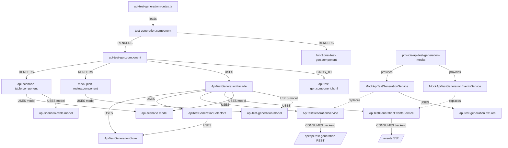

# 03 — Frontend Code Dependency Graph (api-agent / API tab)

Angular dependency graph for the Test Gen frontend
(`api-agent/frontend/test-generation`), focused on the **API-test tab** that
consumes api-agent. The functional tab consumes test-agent and is graphed in
test-agent's own frontend doc (it physically shares this tree — noted below).

## Typed edges — routing & components

| From | Edge | To |
|---|---|---|
| `api-test-generation.routes.ts` | loads | `test-generation.component` |
| `test-generation.component` | RENDERS | `api-test-gen.component`, `functional-test-gen.component` (tabs) |
| `api-test-gen.component` | USES | `ApiTestGenerationFacade` |
| `api-test-gen.component` | RENDERS | `api-scenario-table.component`, `mock-plan-review.component` |
| `api-test-gen.component` | BINDS_TO | `api-test-gen.component.html` |
| `*.component` | BINDS_TO | its `.html` template |

## Typed edges — state & transport

| From | Edge | To |
|---|---|---|
| `ApiTestGenerationFacade` | USES | `ApiTestGenerationStore` (signals) |
| `ApiTestGenerationFacade` | USES | `ApiTestGenerationSelectors` (derived state) |
| `ApiTestGenerationFacade` | USES | `ApiTestGenerationService` (REST) |
| `ApiTestGenerationFacade` | USES | `ApiTestGenerationEventsService` (SSE) |
| `ApiTestGenerationSelectors` | USES | `ApiTestGenerationStore` |
| `ApiTestGenerationService` | CONSUMES | api-agent REST endpoints (see graph 02) |
| `ApiTestGenerationEventsService` | CONSUMES | `GET /events/{id}` via `EventSource` |

## Typed edges — models

| Model file | USED_BY |
|---|---|
| `models/api-scenario.model.ts` (`ApiScenario`, `SprintApiStory`) | table component, facade |
| `models/api-scenario-table.model.ts` | `api-scenario-table.component` |
| `models/api-test-generation.model.ts` (`QueuedTask`, `GenerationJob`, result) | facade, `mock-plan-review.component` |

Presentational components (`api-scenario-table`, `mock-plan-review`) depend on
**models + `@Input`/`@Output` only** — no HTTP/SSE — so they port unchanged.

## Typed edges — mock / DI seam

| From | Edge | To |
|---|---|---|
| `provide-api-test-generation-mocks` | provides (DI) | `MockApiTestGenerationService`, `MockApiTestGenerationEventsService` |
| `MockApiTestGenerationService` | replaces | `ApiTestGenerationService` (transport only) |
| `MockApiTestGenerationService` | USES | `api-test-generation.fixtures` |
| production components | never import | fixtures (one-way dependency) |

## Integration edges (host wiring examples in tree)

| File | Purpose |
|---|---|
| `integration/host-api-config.example.ts` | how the host provides API base + real services |
| `integration/host-app.routes.example.ts` | mounting the feature route in the host |
| `integration/host-test-generation.example.*` | host page composition example |

## TESTED_BY

The frontend ships no `.spec.ts` in this tree today (`TESTED_BY` edges are
empty); contract fidelity is enforced by the backend `test_generation_hardening`
suite and the mock providers mirroring real DTOs. Adding component specs +
Playwright e2e (the `Flow → COVERED_BY → e2e` edge) is the natural next layer.

## Cross-reference

`functional-test-gen.component` and its `store/`, `services/`, `models/`,
`mocks/` live in this same tree but consume **test-agent** (`/api/playwright`).
They are graphed in `test-agent/technical-architecture/dependency-graphs/03`.
