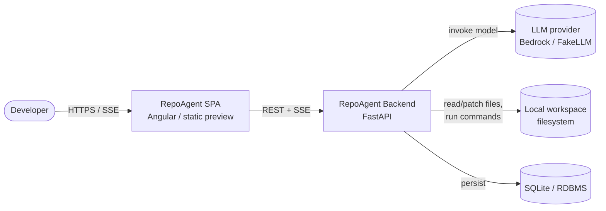
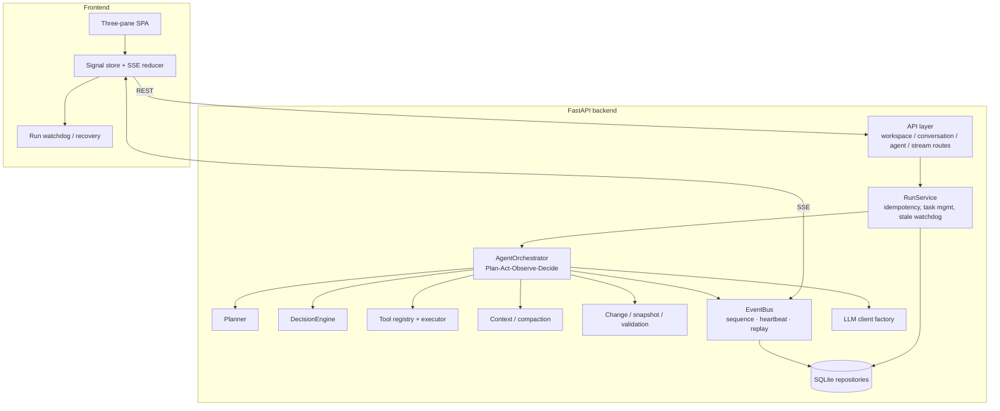
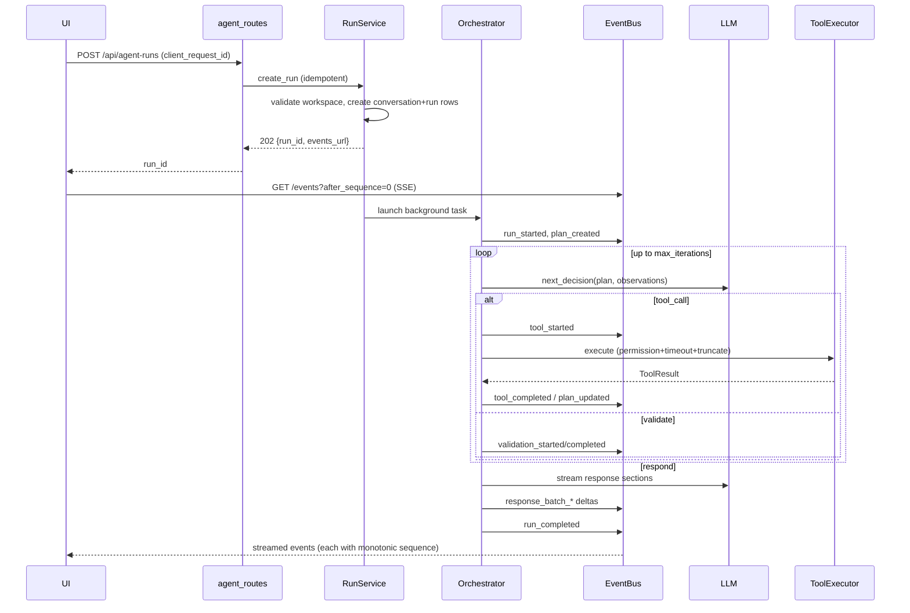

# RepoAgent — Solution Architecture

**Audience:** solution architects, tech leads, platform/DevOps engineers.
**Scope:** the standalone `repo-agent/` application — a local-first AI repository
agent (Ask/Agent) with a single-page UI, streaming over SSE.

Related: [RUNNING.md](RUNNING.md) · [integration-contract.md](integration-contract.md) ·
[DEPLOYMENT.md](DEPLOYMENT.md)

---

## 1. Context & goals

RepoAgent lets a user point at a **local repository**, ask questions (**Ask**
mode) or request changes (**Agent** mode), and watch the agent plan, inspect,
edit, validate, and respond — all streamed live. It is built around one
non-negotiable boundary:

> **The LLM decides *what* it wants to do. The backend decides whether it is
> allowed, how it executes, how much output is returned, and whether the result
> is valid.**

Design goals: transparent streaming execution; no dead-hangs (every run reaches
a terminal state and is recoverable); provider-agnostic LLM; a hard security
sandbox around file and command access.

### C4 — System context

---

## 2. Logical architecture

---

## 3. Component catalogue

| Layer | Component (module) | Responsibility |
|-------|--------------------|----------------|
| API | `app/api/*_routes.py` | REST surface + SSE endpoint; thin, delegates to services |
| Orchestration | `app/agents/run_service.py` | Idempotent run creation, background task launch, cancel, **stale-run watchdog** |
| Orchestration | `app/agents/orchestrator.py` | Run lifecycle + Plan-Act-Observe-Decide loop; guarantees a terminal state |
| Orchestration | `app/agents/planner.py`, `decision_engine.py`, `observation_manager.py`, `response_composer.py` | Structured plan create/advance, next-action decision, observation normalize, semantic response manifest |
| Tools | `app/tools/registry.py`, `executor.py`, `implementations/*` | Tool definitions + **mode permission map**; executor enforces permission, timeout, output truncation; read/write/exec tools |
| Workspace | `app/workspace/{workspace_manager,path_guard,repository_detector}.py` | Resolve + validate workspace root; **sandbox every path**; detect project type/git |
| Context | `app/context/*` | Repo index, file ranking, token-bounded batching, **rolling conversation compaction** |
| Changes | `app/changes/*` | Per-run snapshot, file-change records + diffs, **revert** |
| Validation | `app/validation/*` | Project-aware, **targeted** validation of changed files |
| Streaming | `app/streaming/{event_bus,sse_manager,response_batcher}.py` | Monotonic per-run sequence, heartbeat, **replay**, code-fence-safe response batching |
| LLM | `app/llm/*` | Provider factory; deterministic **FakeLLM**; **Bedrock** client with SSO reset→retry→login→retry |
| Persistence | `app/persistence/*` | stdlib `sqlite3` + repository classes (conversations, messages, runs, events, plans, batches, changes, validation) |
| Cross-cutting | `app/logging/*`, `app/config.py` | Card + JSON logging with correlation contextvars; central settings |

---

## 4. Runtime — request lifecycle

**Dead-hang prevention** runs on both sides: the backend always emits a terminal
event (or the task done-callback / stale watchdog forces one); the frontend
watchdog reconnects with `after_sequence` and falls back to
`GET /api/agent-runs/{id}` — an SSE drop is never treated as a run failure.

---

## 5. Key design decisions (ADR summary)

| # | Decision | Rationale | Trade-off / consequence |
|---|----------|-----------|--------------------------|
| 1 | **Run = stateful `run_id`**, not a blocking HTTP call | Enables SSE streaming, refresh recovery, idempotent retries | Requires event persistence + replay |
| 2 | **Idempotency via `client_request_id`** | One click ⇒ exactly one run despite double-clicks/retries | Client must generate + reuse the key |
| 3 | **In-memory `EventBus` + persisted events** | Low-latency fan-out with replay for reconnect | Single-process by default (see §7) |
| 4 | **LLM behind an interface** (`LLMClient`) | Swap FakeLLM ↔ Bedrock ↔ future Azure/Vertex without touching agent logic | Each provider must implement plan/decide/stream |
| 5 | **`boto3` lazy import** | App runs + tests with zero AWS deps | Bedrock errors surface only at first real call |
| 6 | **stdlib `sqlite3`, repository pattern** | No ORM dependency; trivial local run; DB is swappable | Must externalize DB for multi-instance |
| 7 | **Hard tool permission + `PathGuard` + command allowlist** | The security boundary; Ask can't mutate, paths can't escape | Some legitimate ops need explicit allowlisting |
| 8 | **Structured plan (data, not markdown)** | Plan evolves with discovery; drives the UI plan panel | Planner must maintain step state |
| 9 | **Targeted validation only** | Fast feedback; avoids full test suite per tiny change | Broad regressions need explicit test runs |
| 10 | **Rolling compaction (LLM-free, deterministic)** | Bounded context, reproducible, no extra model calls | Summary is heuristic, not model-authored |

---

## 6. Security model

The trust boundary is enforced entirely server-side:

- **Instruction/authority boundary** — the LLM proposes; the executor authorizes.
- **`PathGuard.resolve_inside_workspace`** rejects `../` traversal and absolute
  paths outside the workspace (unit-tested).
- **Mode permission map** — Ask mode cannot call any write/exec tool; the
  executor rejects illegal mode/tool combinations even if the model requests them.
- **Command execution** uses `create_subprocess_exec` (never a shell string),
  an **allowlist** of executables, per-command timeout, output-size caps, and
  process-tree kill on timeout.
- **Change safety** — agent mutations snapshot first; `apply_patch` is guarded by
  `expected_before_hash` (stale-context protection); runs are revertible.
- **Output bounding** — every tool result is truncated to a max size; huge files
  never enter the context window whole.

> **Gap to close before multi-tenant/production exposure:** the app currently has
> **no authentication/authorization** and executes commands on the host. See
> [DEPLOYMENT.md §Security](DEPLOYMENT.md) for the required isolation (per-run
> sandbox, identity provider, network egress control).

---

## 7. State, concurrency & scalability

**Current model (single instance):**
- `EventBus` is an in-process pub/sub singleton (`get_event_bus`, `lru_cache`).
  SSE subscribers attach to per-run `asyncio.Queue`s. Events are also persisted,
  so replay works, but **live fan-out is process-local**.
- Runs execute as `asyncio` background tasks in the same process.
- `sqlite3` (WAL) is the store.

**Implications for horizontal scale (multiple backend replicas):**

| Concern | Single-instance behaviour | To scale out |
|---------|---------------------------|--------------|
| SSE fan-out | In-memory, process-local | **Sticky sessions** (route a run's SSE to its owning pod) *or* a shared broker (Redis pub/sub) so any replica can serve any run's stream |
| Run execution | In-process task | Keep run + its SSE on the same node (run affinity) or move to a worker queue |
| Persistence | SQLite file | Managed **PostgreSQL** behind the same repository interface |
| Replay after restart | Rebuilt from `run_events` | Unchanged — already DB-backed |

The repository pattern and the `EventBus` seam make both swaps localized changes
rather than rewrites. Until then, run the backend as a **single replica** (or with
sticky sessions per run) and scale vertically.

**Performance notes:** SQLite writes are sub-millisecond and synchronous; the
LLM call and tool subprocesses are the latency drivers and both have timeouts.

---

## 8. Non-functional requirements

| Attribute | How it's addressed |
|-----------|--------------------|
| **Availability** | Every run reaches a terminal state (orchestrator + done-callback + stale watchdog); events are replayable after a restart |
| **Resilience** | SSE reconnect with `after_sequence`; REST fallback; AWS SSO auto-recovery ladder |
| **Observability** | Card console logs + JSON logs; correlation ids (run/conversation/tool) via contextvars; per-run counters |
| **Security** | PathGuard, permission map, command allowlist, hash-guarded patches, output caps (§6) |
| **Performance** | Timeouts on LLM + commands; token-bounded context batches; truncated tool output |
| **Maintainability** | Layered modules; provider/DB behind interfaces; shared enum contract doc |
| **Portability** | Pure-Python backend, static frontend; LLM provider abstraction enables any cloud (§DEPLOYMENT) |

---

## 9. Data model (persisted)

`conversations`, `messages`, `conversation_summaries`, `agent_runs`,
`run_events` (sequence-ordered, for replay), `run_plans`, `response_batches`,
`file_changes`, `validation_results`. Runs carry an authoritative
`last_event_sequence`, `status`, and counters; `agent_runs.client_request_id`
is unique (idempotency key).

---

## 10. Known limitations & roadmap

1. **No auth** — add an identity provider + per-user workspace scoping.
2. **Single-process fan-out** — externalize the event bus (Redis) + DB (Postgres)
   for HA/scale.
3. **Host command execution** — move each Agent run into an isolated sandbox
   (container/microVM per run) before untrusted use.
4. **Only Bedrock + FakeLLM implemented** — add Azure OpenAI / Vertex providers
   via `LLMClient` for cloud-native deployments off AWS.
5. **Heuristic compaction & validation** — optionally upgrade to model-authored
   summaries and richer, language-specific validators.
