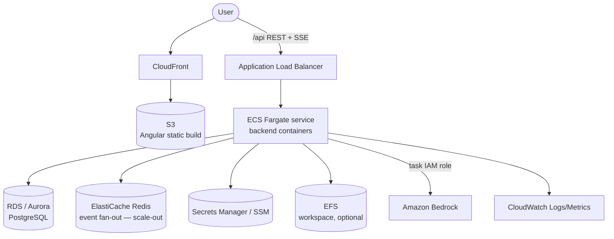

# Deploying RepoAgent on AWS

Read [DEPLOYMENT.md](DEPLOYMENT.md) first — this doc only covers AWS specifics.
AWS is the **native** target: Bedrock is the implemented LLM provider, so no
provider code changes are required.

---

## 1. Reference architecture

## 2. Service mapping

| Capability | AWS service |
|------------|-------------|
| Static frontend | **S3** (private bucket) + **CloudFront** (OAC) |
| Backend runtime | **ECS Fargate** (recommended) · App Runner (simplest) · EKS (if already on k8s) |
| Load balancer | **ALB** (HTTP/1.1, streaming-friendly) |
| LLM | **Amazon Bedrock** via task **IAM role** |
| Database | **RDS for PostgreSQL** or **Aurora Serverless v2** |
| Event fan-out (scale-out) | **ElastiCache for Redis** |
| Secrets/config | **Secrets Manager** + **SSM Parameter Store** |
| Workspace filesystem | **EFS** (shared) or per-run clone from CodeCommit/GitHub |
| Per-run sandbox | Dedicated **Fargate task** per run (or Firecracker on EKS) |
| Container registry | **ECR** |
| User auth | **Cognito** or **ALB OIDC/OAuth** |
| Observability | **CloudWatch** Logs + Metrics, **X-Ray** |
| IaC | **CDK** / CloudFormation (or Terraform) |

## 3. Deploy steps (Fargate)

1. **Build & push image** to ECR: `docker build -t <acct>.dkr.ecr.<region>.amazonaws.com/repo-agent-backend backend && docker push …`.
2. **Task definition** — set env:
   - `REPO_AGENT_LLM_PROVIDER=bedrock`, `REPO_AGENT_AWS_REGION=<region>`,
     `REPO_AGENT_BEDROCK_MODEL_ID=…` (leave `AWS_PROFILE` empty — the task role
     supplies credentials via the default provider chain).
   - `REPO_AGENT_DATABASE_PATH` → EFS mount path, or point the repository layer at RDS.
   - `REPO_AGENT_CORS_ALLOW_ORIGINS=https://<cloudfront-domain>`.
3. **Task IAM role** — attach a least-privilege policy allowing
   `bedrock:InvokeModel` / `bedrock:InvokeModelWithResponseStream` on the chosen
   model ARNs (no `aws sso login` path needed inside AWS — the role auto-refreshes).
4. **ALB** — target group to the Fargate service; **idle timeout 900s**; health
   check `GET /api/health`. Enable **stickiness** (per-run affinity) until Redis
   fan-out is added.
5. **Frontend** — `ng build`, sync `dist/repo-agent/browser` to S3, serve via
   CloudFront; point the SPA's `/api` at the ALB (or same-origin behind CloudFront
   with a `/api/*` behavior forwarding to the ALB).
6. **Front auth** — put Cognito (ALB authenticate-oidc action) in front for
   multi-user access.

## 4. AWS-specific notes

- **Bedrock IAM > SSO inside AWS.** The interactive `aws sso login` recovery in
  the code is for local/dev; in AWS the task role refreshes automatically, so
  that path simply won't trigger.
- **ALB & SSE.** ALB streams fine over HTTP/1.1; the critical setting is the
  **idle timeout** (default 60s → raise to 900s) so long runs aren't cut. The app
  already sends 15s heartbeats and `X-Accel-Buffering: no`.
- **Model access** must be explicitly enabled in the Bedrock console per model,
  per region.
- **Command-exec sandbox.** For untrusted workspaces, run each Agent run as its
  own short-lived Fargate task with no egress except the Bedrock VPC endpoint.
- **Networking.** Use a **Bedrock VPC endpoint** (PrivateLink) to keep model
  traffic off the public internet.

## 5. Rough cost drivers

Bedrock tokens dominate. Fargate (~0.5 vCPU/1 GB per replica), a small RDS/Aurora
Serverless, optional ElastiCache, S3+CloudFront egress, and CloudWatch are all
secondary. Scale backend replicas on **concurrent runs**, not CPU.
