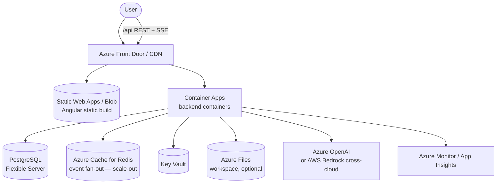

# Deploying RepoAgent on Azure

Read [DEPLOYMENT.md](DEPLOYMENT.md) first. On Azure you choose the LLM path:
**Azure OpenAI** (cloud-native, requires adding a provider) or **AWS Bedrock
cross-cloud** (works today, needs AWS credentials).

---

## 1. Reference architecture

## 2. Service mapping

| Capability | Azure service |
|------------|---------------|
| Static frontend | **Azure Static Web Apps** or **Blob Storage** + **Front Door/CDN** |
| Backend runtime | **Azure Container Apps** (recommended — SSE, session affinity, scale-to-zero) · **AKS** (if on k8s) |
| Ingress/LB | **Front Door** or **Application Gateway** |
| LLM | **Azure OpenAI** (add provider) · or **AWS Bedrock** cross-cloud |
| Database | **Azure Database for PostgreSQL — Flexible Server** |
| Event fan-out (scale-out) | **Azure Cache for Redis** |
| Secrets/config | **Azure Key Vault** (+ **Managed Identity**) |
| Workspace filesystem | **Azure Files** (SMB) mount, or per-run clone from Azure Repos/GitHub |
| Per-run sandbox | **Azure Container Instances** per run, or AKS + gVisor |
| Container registry | **Azure Container Registry (ACR)** |
| User auth | **Microsoft Entra ID** via Container Apps / App Service **Easy Auth** |
| Observability | **Azure Monitor**, **Application Insights**, **Log Analytics** |
| IaC | **Bicep / ARM** (or Terraform) |

## 3. Deploy steps (Container Apps)

1. **Build & push** the backend image to **ACR**.
2. **Create a Container App** from the image; enable **ingress** (external),
   **HTTP** with **session affinity = sticky** (per-run SSE routing).
3. **Managed Identity** — assign a user/system-assigned identity; grant it **Key
   Vault** `get` on secrets. Read config/secrets at startup.
4. **Env / secrets:**
   - **Azure OpenAI path:** add an `azure_openai` provider implementing
     `LLMClient`, register it in `client_factory`, and set its endpoint + Key
     Vault-backed key; use `az login`/Managed Identity token auth where possible.
   - **Bedrock cross-cloud path:** set `REPO_AGENT_LLM_PROVIDER=bedrock` and supply
     least-privilege **AWS** creds via Key Vault (rotate regularly).
   - `REPO_AGENT_DATABASE_PATH` → Azure Files mount, or point the repository layer
     at PostgreSQL.
   - `REPO_AGENT_CORS_ALLOW_ORIGINS=https://<frontend-host>`.
5. **Frontend** — deploy the Angular build to Static Web Apps (or Blob + Front
   Door); route `/api/*` through Front Door to the Container App.
6. **Auth** — enable **Easy Auth** (Entra ID) on the Container App / Front Door.

## 4. Azure-specific notes

- **Container Apps suits SSE well** — HTTP ingress supports streaming; set the
  request/response timeout high and keep **session affinity** on until Redis
  fan-out is added. (If using App Gateway, raise its **request timeout**.)
- **Provider choice.** Prefer **Azure OpenAI** to keep model traffic and identity
  in-cloud (Managed Identity, Private Endpoint). Cross-cloud Bedrock means storing
  AWS creds in Key Vault and egress to AWS — heavier and less ideal.
- **Private networking** — use **Private Endpoints** for PostgreSQL, Key Vault,
  and (if Azure OpenAI) the OpenAI resource; restrict Container Apps egress.
- **Command-exec sandbox** — run each Agent run as an **ACI** container (or AKS +
  gVisor) with no outbound network except the model endpoint.

## 5. Rough cost drivers

Model tokens (Azure OpenAI or Bedrock) dominate. Container Apps (consumption
plan, scale-to-zero), a small Flexible Server, optional Redis, Static Web Apps,
and Azure Monitor are secondary.
