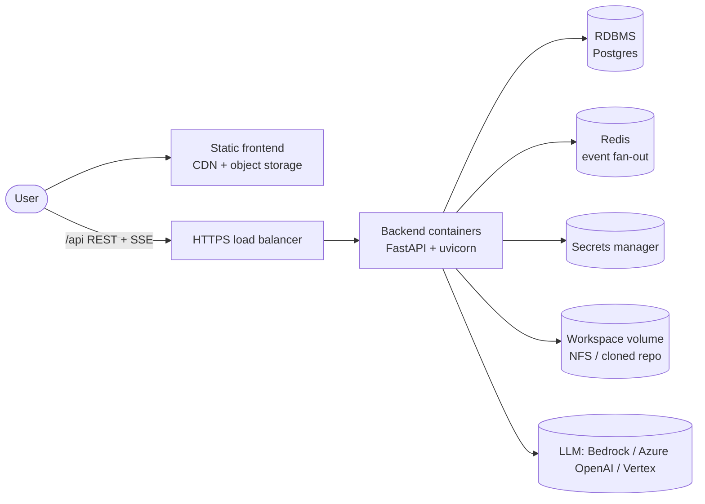
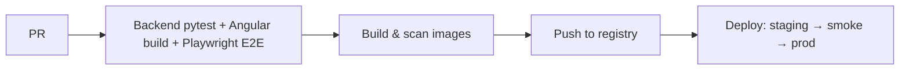

# Deploying RepoAgent — cross-cutting guide

Concerns that apply to **every** cloud, plus the container artifacts. For
cloud-specific service mappings and steps:

- [DEPLOYMENT-AWS.md](DEPLOYMENT-AWS.md)
- [DEPLOYMENT-AZURE.md](DEPLOYMENT-AZURE.md)
- [DEPLOYMENT-GCP.md](DEPLOYMENT-GCP.md)

Read this first — the per-cloud docs assume it.

---

## 1. Deployment topology

Two deployable units plus backing services:



- **Frontend** — `ng build` static assets → object storage behind a CDN. (Or use
  the backend's built-in `/preview` for demos.)
- **Backend** — the FastAPI container, behind an HTTPS load balancer that
  supports long-lived streaming responses.

---

## 2. Containerization

Build artifacts live in the repo:

- `backend/Dockerfile` — Python 3.11 slim image running uvicorn.
- `frontend/Dockerfile` — multi-stage: `ng build` then serve via nginx.
- `frontend/nginx.conf` — SPA fallback **and** an SSE-safe `/api` proxy
  (buffering off, long read timeout).
- `docker-compose.yml` — backend + frontend for local/prod-like runs (Postgres +
  Redis are included as commented scale-out services; the app uses SQLite + an
  in-memory bus today).

```bash
cd repo-agent
docker compose up --build      # frontend :8081, backend :8080
```

The images are the unit of deployment for every cloud below (push to ECR / ACR /
Artifact Registry).

---

## 3. What must change for production (vs the local defaults)

| Local default | Production requirement | Why |
|---------------|------------------------|-----|
| `FakeLLM` | Real provider (Bedrock / Azure OpenAI / Vertex) | Actual model responses |
| SQLite file | Managed **PostgreSQL** | Durability, multi-instance, backups |
| In-memory event bus | **Sticky sessions per run** *or* Redis pub/sub | SSE fan-out across replicas |
| Local workspace path | **Mounted volume or per-run clone** | Containers have no user filesystem |
| Host command execution | **Isolated sandbox per run** | Untrusted code/command execution |
| No auth | **Identity provider in front** | Multi-user / internet exposure |
| CORS to localhost | Real origins via `REPO_AGENT_CORS_ALLOW_ORIGINS` | Browser security |

> The event-bus and persistence seams are behind interfaces (`get_event_bus`,
> the repository classes), so externalizing them is a localized change, not a
> rewrite — but until done, **run the backend as a single replica or with
> per-run sticky routing.**

---

## 4. The SSE + load-balancer checklist (all clouds)

RepoAgent streams over Server-Sent Events. Every load balancer / gateway / proxy
in the path must:

1. **Not buffer** `text/event-stream` (the app sets `X-Accel-Buffering: no`;
   configure the proxy to honour it).
2. Have an **idle/response timeout greater than the heartbeat** (default 15s) and
   ideally longer than the longest run (minutes). Bump LB idle timeouts to 5–15 min.
3. Support **HTTP/1.1 keep-alive** (and HTTP/2 where the platform streams over it).
4. Use **sticky sessions** keyed so a run's SSE reconnect returns to the pod that
   owns it — until the Redis event bus is adopted.
5. Point **health checks** at `GET /api/health` (fast, dependency-light).

---

## 5. Secrets & identity

Never bake credentials into images or env files. Prefer **workload identity**:

- The backend should assume a cloud identity (IAM role / Managed Identity /
  Workload Identity) and read config from the platform secrets store at startup.
- For AWS Bedrock specifically, use a task/pod **IAM role**; for cross-cloud
  Bedrock from Azure/GCP you must supply AWS credentials (least-privilege, rotated).

---

## 6. Workspace & command-execution isolation (the big one)

RepoAgent reads/edits files and runs commands **on the backend host**. In a
shared/cloud deployment this is the primary risk. Options, least→most isolated:

1. **Per-request clone (recommended default)** — clone the target repo into an
   ephemeral working dir per run, discard after. Deterministic, stateless.
2. **Mounted network filesystem** (EFS / Azure Files / Filestore) — for
   long-lived shared workspaces; watch permissions and blast radius.
3. **Sandbox per run** — run each Agent execution in its own container / microVM
   (Fargate task, ACI container, Cloud Run job, gVisor/Firecracker) with:
   - read-only base image, writable scratch only,
   - **no outbound network** except the LLM endpoint,
   - CPU/memory/time limits,
   - a dropped, non-root user.

Keep the executable **allowlist** tight and treat the workspace as untrusted input.

---

## 7. LLM provider per cloud

The `LLMClient` interface (`app/llm/base.py`) means the model backend is a config
choice, not a code change point:

| Cloud | Native option | Notes |
|-------|---------------|-------|
| AWS | **Bedrock** (implemented) | Pod IAM role; no keys. Cheapest network path. |
| Azure | **Azure OpenAI** (add a provider) | Or call Bedrock cross-cloud with AWS creds. |
| GCP | **Vertex AI** (Gemini / Claude on Vertex) (add a provider) | Or cross-cloud Bedrock. |

Adding a provider = implement `create_plan` / `next_decision` /
`plan_response_sections` / `stream_section` and register it in
`client_factory.build_llm_client`.

---

## 8. CI/CD (provider-agnostic shape)



- **Test gate:** `pytest` (backend), `ng build` + `playwright test` (frontend).
- **Migrations:** when moving to Postgres, run schema migration as a pre-deploy job.
- **IaC:** Terraform works on all three; native options noted per cloud.

---

## 9. Observability

- Backend emits **structured JSON logs** (enable the file/stdout JSON handler) with
  run/conversation/tool correlation ids — ship to the cloud log service.
- Add metrics for: active runs, run duration, tool-call count/latency, LLM latency,
  SSE connections, stale-run count.
- Health: `GET /api/health`. Consider a readiness probe that also checks DB.

---

## 10. Cross-cloud service map (quick reference)

| Capability | AWS | Azure | GCP |
|------------|-----|-------|-----|
| Static frontend | S3 + CloudFront | Static Web Apps / Blob + Front Door | Cloud Storage + Cloud CDN |
| Backend containers | ECS Fargate / App Runner / EKS | Container Apps / AKS | Cloud Run / GKE |
| Load balancer (SSE) | ALB | Front Door / App Gateway | HTTPS LB |
| LLM | Bedrock | Azure OpenAI (or Bedrock) | Vertex AI (or Bedrock) |
| Database | RDS / Aurora Postgres | Postgres Flexible Server | Cloud SQL Postgres |
| Event bus (scale-out) | ElastiCache Redis | Azure Cache for Redis | Memorystore Redis |
| Secrets | Secrets Manager / SSM | Key Vault | Secret Manager |
| Identity for app | IAM role | Managed Identity | Workload Identity |
| Workspace FS | EFS | Azure Files | Filestore |
| Per-run sandbox | Fargate task / Firecracker | ACI / AKS+gVisor | Cloud Run job / GKE+gVisor |
| User auth | Cognito / ALB OIDC | Entra ID (Easy Auth) | IAP / Identity Platform |
| Observability | CloudWatch / X-Ray | Azure Monitor / App Insights | Cloud Logging / Trace |
| IaC | CDK / CloudFormation / Terraform | Bicep / ARM / Terraform | Terraform / Deployment Manager |

---

## 11. Sizing & cost drivers

- **Dominant cost = LLM tokens.** Everything else (small containers, a small
  Postgres, a small Redis, CDN) is minor by comparison.
- Backend is I/O-bound (waiting on the LLM); start at ~0.5 vCPU / 1 GB per replica
  and scale on concurrent runs, not CPU.
- SSE holds a connection per active run — size the LB/connection limits for peak
  concurrent runs, not total users.
