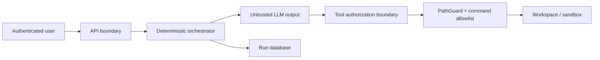

# Security model and threat analysis

**Status:** local/development-ready; not approved for multi-tenant or public
deployment without the production controls below.

## 1. Assets and trust boundaries

Protected assets are workspace source and secrets, repository history, service
credentials, LLM prompts/responses, run artifacts, and host compute/network
access. Inputs from users, repositories, LLMs, tool output, and model providers
are untrusted.

The LLM never confers authority. Repository text can contain prompt injection;
it is data, not an authorization source.

## 2. Existing controls

| Threat | Current control | Required regression evidence |
|---|---|---|
| Path traversal | `PathGuard.resolve_inside_workspace` | parent and absolute escape tests |
| Unauthorized mutation in Ask mode | server-side tool permission map | executor denial and no mutation |
| Arbitrary shell execution | executable allowlist and argument-vector subprocess | denied executable test |
| Stale overwrite | `expected_before_hash` on patches | unchanged file on mismatch |
| Unbounded execution/output | tool timeouts and output caps | timeout/truncation tests |
| Partial/crashed mutation | per-run snapshot and revert | change/revert integration evidence |
| Duplicate user action | `client_request_id` idempotency | same key returns same run |
| Hanging execution | terminal-event guarantees and stale watchdog | stale run becomes failed |
| Credential expiry | classified Bedrock recovery flow | provider error contract tests |

## 3. Known gaps and release blockers

Before exposure beyond a trusted single-user host, all of these are blockers:

- authenticate users and authorize workspace/run access;
- isolate every Agent run in a non-root container or microVM with resource caps;
- provide each run a dedicated workspace; never accept unrestricted host paths;
- deny network egress by default and explicitly allow only required endpoints;
- externalize durable state and encrypt it in transit and at rest;
- manage credentials through workload identity or a secrets manager;
- audit security-relevant actions without logging source contents or secrets;
- rate-limit run creation, SSE connections, LLM use, and command execution;
- add dependency/container scanning and a patching owner;
- validate symlink, TOCTOU, archive, oversized-input, and process-tree behavior.

`PathGuard` is defense in depth, not a substitute for process isolation.

## 4. Security requirements for new tools

Every new tool must define allowed modes, whether it mutates, timeout, maximum
input/output, path handling, subprocess/network behavior, failure semantics, and
audit metadata. Its test matrix must cover allowed use, denied mode, malformed
input, boundary escape, timeout/resource exhaustion, and non-mutation on failure.

Never accept a shell command string. Resolve paths immediately before use, avoid
following symlinks outside the workspace, and pass commands as executable plus
arguments. Do not place secrets in tool results sent to the model.

## 5. Data handling

- Treat prompts, source files, diffs, tool output, and responses as sensitive.
- Send only the minimum required context to the configured LLM provider.
- Do not log file contents, credentials, authorization headers, or full prompts.
- Define retention and deletion for conversations, runs, events, and snapshots
  before production use.
- A user's delete request must cover derived summaries and artifacts, not only
  the conversation row.

## 6. Security review triggers

Require explicit security review for a new tool, command allowlist expansion,
authentication/authorization change, new provider or outbound destination,
workspace/path handling, secret storage, persistence/retention change, public
endpoint, or sandbox relaxation.

## 7. Incident first response

If workspace escape, credential exposure, or unauthorized execution is
suspected: stop new Agent runs, preserve logs and run identifiers, isolate the
affected worker, revoke relevant credentials, preserve the workspace snapshot,
and follow [Operations](OPERATIONS.md). Do not paste sensitive evidence into a
public issue.
