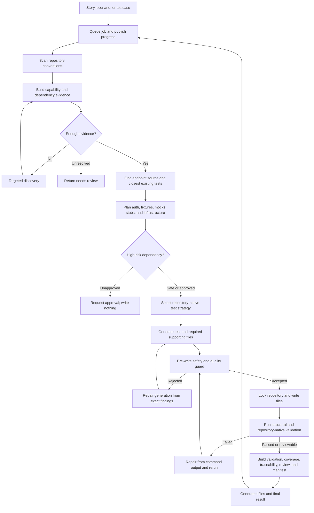
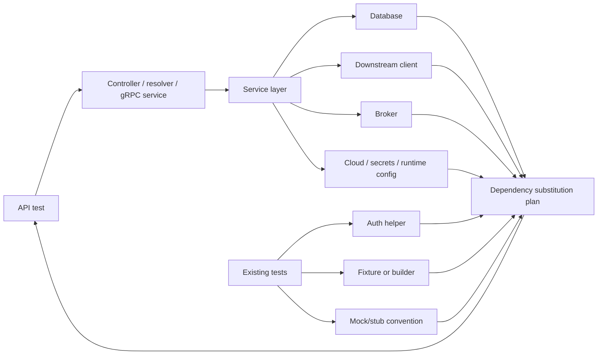
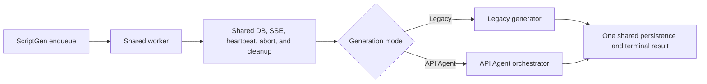

# API Agent: Complete workflow

## What the API Agent does

The API Agent turns a user story, API scenario, or existing testcase into API
tests that follow the target repository's real conventions.

It does not start by choosing a familiar test framework. It first inspects the
repository to answer:

- What API transport are we testing: REST, GraphQL, gRPC, or reactive HTTP?
- Which endpoint, controller, resolver, or service owns the behavior?
- Which test framework and helpers does the repository already use?
- Which authentication, fixtures, builders, mocks, and stubs can be reused?
- Which dependencies need isolation?
- Where does the test belong, and which command proves it works?

The result is generated code plus the evidence needed to review it.

## End-to-end workflow



## Inputs

The workflow supports three entry paths.

### Story to API scenarios

Input:

- Story title and description.
- Acceptance criteria.
- Repository path.
- Tenant, branch, and additional context.

Output: grounded API scenarios with repository findings, warnings, value
assessment, traceability, and review reasons.

Use this to choose the API coverage before generating code.

### Selected scenario to code

Input:

- Scenario ID, name, steps, and assertions.
- Repository path.
- Optional endpoint, method, and service name.
- Execution target: CI, stage, or both.
- Validation preference and high-risk mock approval.

Output: generated API-test files with strategy, validation, dependencies, and
review evidence.

### Existing testcase to code

The ScriptGen-style request is normalized as follows:

```text
setup_steps + testcase_steps -> scenario_steps
testcase_id                  -> api_scenario_id
testcase_name                -> scenario_name
target_env                   -> execution_target
```

This lets the API Agent reuse the existing ScriptGen lifecycle instead of
creating another queue, SSE stream, DB status flow, or cleanup path.

## What each stage does

### 1. Queue and lifecycle

`ApiTestGenerationTaskManager` creates an idempotency key, queues the work,
publishes SSE progress, supports abort, and records the final result.

Repeated requests with the same inputs reuse the existing queued, running, or
completed task. This prevents duplicate jobs from editing the same repository.

Current limitation: the API Agent task store is in memory. Persisting job state
is a future improvement.

### 2. Repository profile

`ApiRepoContextService` detects:

- Languages, build tool, and package manager.
- API endpoints and transports.
- Existing API tests.
- Test and assertion frameworks.
- Authentication helpers, fixtures, builders, and API clients.
- Mocking, stubbing, and contract-test conventions.

Why: functional steps tell us what to test; repository evidence tells us how to
test it correctly.

### 3. Capability and evidence graph

Detectors connect repository facts into capabilities. For example:

```text
Spring controller
+ MockMvc dependency
+ existing MockMvc tests
= strong MockMvc generation capability
```

When evidence is incomplete, targeted discovery searches for specific missing
symbols or test mechanisms. If the gap remains unresolved, the result is marked
for review instead of silently guessing.

### 4. Scenario-specific context

`SourceContextService` narrows the repository context to:

- The endpoint/controller/resolver/service being tested.
- The closest existing API tests.
- Relevant fixtures, auth setup, builders, and helper snippets.

This avoids generating from noisy repository-wide context and gives the model a
working test pattern to reuse.

### 5. Dependency and mock/stub plan

The agent builds this dependency view:



Each dependency is classified as real in-process behavior, a mock, a stub, a
fixture override, a test container, a stage-only dependency, or high-risk
infrastructure.

Cloud resources, credentials, brokers, or other high-risk infrastructure need
explicit approval. Without approval, no files are written.

### 6. Strategy selection

The strategy is selected from registered options using repository evidence.

| Repository evidence | Expected strategy |
|---|---|
| Spring MVC and MockMvc tests | Spring MockMvc |
| Spring integration tests using RestAssured | RestAssured |
| Reactive WebFlux | WebTestClient |
| Spring GraphQL | GraphQlTester |
| gRPC service and protobuf definitions | In-process gRPC |
| FastAPI | FastAPI TestClient |
| Async Python HTTP tests | pytest + HTTPX |

The decision records confidence, supporting evidence, rejected alternatives,
and unresolved questions.

### 7. Generation

The generation agent receives the scenario, selected strategy, endpoint source,
closest tests, reusable helpers, and dependency plan.

It may generate multiple files when required:

- The API test.
- Fixtures or test-data builders.
- Mock/stub configuration.
- Contract or request fixtures.
- Test-only dependency overrides.

Do not change production application files without an explicitly designed and
approved capability.

### 8. Pre-write guard and repair

Before writing, `GeneratedFileGuard` checks:

- Paths are inside valid test locations.
- The selected test strategy is actually used.
- Assertions prove the requested behavior.
- Required mocks/stubs are included.
- Execution targets match the generated files.
- Unsafe application-source overwrites are rejected.

Rejected output enters a bounded repair loop. The next attempt receives the
exact findings instead of a generic "generation failed" message.

### 9. Workspace and writing

The workflow acquires a repository-scoped lock and snapshots target files before
writing. This prevents concurrent jobs from changing the repository during
generation and validation.

Current gap: writing is still mainly file-based. Add these structural operations
in the next version:
structural operations such as:

- `append_test_method`
- `replace_test_method`
- `insert_fixture`
- `insert_mock_setup`
- `insert_import`

Resolve the current class or method node immediately before writing. Do not use
stale line numbers.

### 10. Validation and execution repair

Validation runs in layers:

```text
File exists
-> selected strategy is present
-> transport-specific rules pass
-> repository command resolves
-> compile/test command executes when enabled
```

Examples:

- WebFlux tests use `WebTestClient` and avoid fixed sleeps.
- GraphQL tests execute a document and assert data paths or errors.
- gRPC tests create and clean up the in-process server/channel and assert
  the response or gRPC status.

When execution fails, the actual command and failure output are sent into a
bounded repair loop. Repaired files go through the guard again before rewriting
and rerunning.

Keep the final failed attempt with its validation output so engineers can see
what needs fixing.

### 11. Reporting

The final result includes:

- Generated files and their purpose.
- Validation command, status, and details.
- Selected strategy, confidence, and reasons.
- Existing tests and helpers reused.
- Source files used.
- Mock/stub plan and approval decisions.
- Warnings and review reasons.
- Coverage-change report.
- Traceability matrix.
- Human-readable review report.
- Generation manifest for reproducibility.

Traceability does not need a one-to-one step mapping. One test can cover several
functional steps, and one requirement may be implemented by setup, an action,
and multiple assertions.

`needs_review=true` does not mean generation failed. It means the result exists
but still carries a risk, low-confidence decision, validation issue, or manual
approval requirement.

## Terms used in this workflow

### Coverage

In the current API Agent, coverage means **API behavior signals found in the
test files touched by generation**. It does not mean runtime line, branch, or
method coverage from JaCoCo, Istanbul, Coverage.py, or another coverage tool.

The service reads each affected test file before and after writing and extracts:

- API endpoints called.
- Status assertions.
- Response-body, JSON-path, or schema assertions.
- Authentication signals such as bearer, OAuth, basic auth, JWT, or API keys.

The report classifies files as preserved, added, removed, or modified. A
modified file lists the signals it lost and gained. `coverage_preserved=false`
means generation removed an existing file or removed one of these behavioral
signals.

Example:

```text
Before: endpoint /orders/{id}, status 200, body field orderId, bearer auth
After:  endpoint /orders/{id}, status 200

Result: coverage weakened because body-field and auth signals disappeared
```

This is a source-level regression check. A passing test command gives stronger
runtime evidence, but the current coverage report does not calculate executed
lines or branches.

### Traceability

Traceability connects the original acceptance criteria, scenario steps, and
assertions to a generated scenario or code artifact.

Each requirement is marked `covered` or `missing` and records the matching
artifact, evidence text, and match score. The mapping is not one-to-one. One
test block can cover several steps, and one requirement can span setup, action,
and assertions.

### Evidence

Evidence is a repository fact used to make a decision. Examples include a
dependency in `pom.xml`, a `WebTestClient` call in an existing test, a GraphQL
schema file, a controller annotation, or a detected validation command.

Each evidence record stores its source, detector, type, confidence, and stable
evidence ID. Strategy decisions refer back to these IDs.

### Capability

A capability is something the repository can support based on evidence, such
as `spring_webflux`, `graphql_tester`, `grpc_in_process`, `mockwebserver`, or
`pytest_httpx`.

A capability can depend on other capabilities or conflict with them.

### Testing topology

The testing topology is the combined view of application framework, inbound API
transport, test driver, mock mechanisms, test locations, reactive model, and
validation commands. Readiness comes from this view.

### Source context

Source context is the small set of repository code relevant to one scenario:
the endpoint implementation, closest tests, fixtures, builders, auth helpers,
and related source snippets. It keeps generation focused on the selected API
flow.

### Strategy

The strategy is the concrete repository-native way to test the API, such as
MockMvc, WebTestClient, GraphQlTester, in-process gRPC, FastAPI TestClient, or
pytest with HTTPX.

### Bootstrap

Bootstrap is the minimum test harness needed to start the selected strategy.
Examples include a random-port Spring test, a GraphQL test slice, a WebFlux test
context, or an in-process gRPC server. It does not mean bootstrapping a new
application or production environment.

### Dependency substitution

Dependency substitution describes how a test replaces an external dependency.
Examples include MockWebServer for an HTTP client, a mocked repository, a fake
identity provider, or an in-process test container.

### Guard

A guard checks candidate code before writing. It rejects unsafe paths, missing
assertions, wrong execution targets, missing mocks, and output that does not use
the selected test framework.

### Validation

Validation checks written files. It starts with file and strategy checks, then
resolves and optionally runs the repository's real compile or test command.

### Repair

Repair is another bounded generation attempt using exact guard findings or test
command output from the previous attempt.

### Scaffold

A scaffold is deterministic fallback code or scenarios produced when model
generation fails or every candidate file is rejected. It provides a starting
structure, not proven test coverage. Scaffold output always needs review.

### Generation manifest

The manifest records the repository state, policy, model/prompt information,
decisions, and generated-artifact hashes for one run. It supports debugging and
reproducibility; it does not validate the generated test.

### CI, stage, and both

- `ci`: fast and isolated tests that run during pull-request validation.
- `stage`: tests against a deployed environment and its real integrations.
- `both`: separate CI and stage variants when the repository supports both.

## ScriptGen integration rule

The API Agent owns API discovery, planning, generation, validation, and its
result. ScriptGen owns the shared operational lifecycle:



Do not maintain separate agentic copies of DB status, SSE, heartbeat, abort
handling, execution details, terminal failure, or cleanup. Two lifecycle
implementations will drift and leave jobs stuck or publish inconsistent results.

## Current decision rules and fallbacks

This section describes what the code does today, including the less obvious
fallback and bootstrap paths.

### How much evidence is enough?

Evidence records have a type, source, detector, confidence, and evidence ID.
The current evidence types are dependency, source usage, existing test,
configuration, schema, command, and inference.

The topology decision looks for four critical facts:

| Required fact | Score when found | Score when missing |
|---|---:|---:|
| Application framework | 1.0 | 0.0 |
| Inbound API transport | 1.0 | 0.0 |
| Existing test mechanism | 1.0 | 0.35 |
| Test placement convention | 1.0 | 0.4 |

The topology confidence is the average of these four values. Missing facts also
become unresolved edges, so a numerically reasonable score does not bypass
targeted discovery.

Current evidence confidence examples:

- Existing test mechanism: `1.0`.
- Existing mock mechanism: `0.95`.
- Validation command: `0.95`.
- Framework and endpoint source usage: `0.9`.
- API style or schema evidence: typically `0.8`.
- Derived strategy without an existing convention: usually around `0.7–0.72`.

The readiness result is:

- `ready` when framework, transport, test mechanism, and placement are resolved.
- `needs_more_evidence` when any required relationship is unresolved.
- `needs_review` when multiple transports are present and topology confidence
  is below `0.8`, or targeted discovery cannot resolve the gap.

Discovery is bounded to two rounds by default. It stops early when the same
request would repeat, when no new evidence is found, or when readiness is
resolved. Assessment results are cached against repository revision and detector
versions, so changed source or detector logic invalidates stale evidence.

Current state: capability assessment still reports
`shadow_mode=true`. The new evidence-driven plan informs generation, but the
legacy strategy registry remains available as a compatibility fallback.

### What happens during bootstrap?

Bootstrap means the minimum test harness needed to run the selected strategy.
It is not application startup or a reason to create arbitrary infrastructure.

Current composed plans use:

| Strategy | Bootstrap behavior |
|---|---|
| WebFlux/WebTestClient | `spring_boot_webflux_test` |
| GraphQL with an in-process tester | `spring_graphql_test` |
| GraphQL through HTTP | `spring_boot_random_port` |
| gRPC | `grpc_in_process_server` |

The plan also records the inbound driver, fixture strategy, assertion strategy,
cleanup strategy, dependency substitutions, and validation commands.

Bootstrap decisions follow repository evidence. For example, a WebClient
dependency reuses MockWebServer or WireMock when detected. If neither exists,
MockWebServer is only a source-derived recommendation with lower confidence and
requires review. gRPC bootstrap includes server/channel cleanup. GraphQL
bootstrap executes a real operation document.

### Scenario fallback behavior

If scenario generation throws an exception or returns no scenarios, the current
code emits three deterministic scaffold scenarios:

1. Positive happy-path CI scenario.
2. Negative validation CI scenario.
3. Deployed integration stage scenario.

It uses the first detected endpoint when available; otherwise it falls back to
`POST /api/resource` and `ApiService`. These scenarios are explicitly labelled
`SCAFFOLD`, are not considered real story-derived coverage, and require manual
review.

After generation, scenario guards remove duplicate IDs and scenarios without
actionable steps or assertions. Value scoring currently uses signal overlap:

- `>= 0.85`: full duplicate; drop it.
- `>= 0.55`: partial duplicate.
- `>= 0.25`: meaningful variation.
- `< 0.25`: new coverage.
- No assertions: low value.

### Test-code fallback behavior

The normal path gives the model up to two generation-repair attempts by default
when the file guard rejects output.

If all model-generated files are rejected, the service asks
`StrategyRegistry` for a deterministic fallback strategy and writes scaffold
skeletons. The summary is marked `SCAFFOLD` and the result is flagged for
review because this is not proven coverage.

The registry selects the highest-confidence compatible strategy. When nothing
matches and legacy fallback is enabled:

- Python repositories receive a low-confidence pytest/HTTP fallback.
- Other repositories receive a low-confidence Java/Spring MockMvc fallback.

If `allow_legacy_strategy_fallback=false`, no compatible strategy is a hard
error instead of a generic scaffold.

Repository-discovery-agent failure is softer: deterministic profile evidence is
still used and generation continues. Budget exhaustion is different. In the
current default `review` mode it adds review reasons; `strict` mode raises and
stops the run.

### CI, stage, and both variants

Current behavior:

| Target | Expected behavior |
|---|---|
| CI | Fast, deterministic, no real external network, dependencies mocked or stubbed |
| Stage | Deployed endpoint, repository auth/config helpers, real integration behavior, no test mocks |
| Both | Distinct CI and stage variants when repository conventions differ |

There are several current enforcement rules:

- A CI request emits files with `test_target=ci`.
- A stage request emits files with `test_target=stage`.
- Repository policy forbids real network URLs in CI by default.
- When the dependency plan requires mocks, CI output contains a recognized
  mocking/stubbing mechanism.
- Stage generation is instructed not to emit mocks or stubs.
- Stage validation uses the detected stage command when available.
- CI validation uses the detected CI command when available.

If a scenario is classified as stage or both but the repository has no stage
command, stage test location, or existing stage examples, it is downgraded to
CI and marked for review.

Current gap: the prompt asks `both` to generate distinct variants, but the file
guard does not yet prove that both a CI file and a stage file were emitted. Add
an explicit validation rule for this.

### Policy and failure severity

Repository policy currently checks maximum generated files, real network use
in CI, allowed frameworks, negative-scenario requirements, and duplicate
coverage rules.

Most policy findings are currently attached as review reasons after generation;
they do not all block writing. The next policy pass needs explicit severity:

- Hard: unsafe path, invalid structure, ambiguous target, missing required file.
- Repairable: missing mock, wrong execution target, compile/test failure.
- Advisory: low-confidence strategy, coverage interpretation, traceability, or
  file-count preference unless the repository explicitly makes it mandatory.

## Failure behavior

| Failure | Expected behavior |
|---|---|
| Invalid request | Reject before queueing |
| Repeated identical request | Reuse existing task |
| Insufficient repository evidence | Targeted discovery, then needs review |
| High-risk dependency without approval | Request approval and write nothing |
| Unsafe generated file | Repair before writing |
| Repository locked | Return a clear lock failure or controlled retry |
| Test execution failed | Repair using the real command output |
| Repair exhausted | Retain final files and failure evidence |
| User abort | Publish one aborted terminal result |
| DB commit failed | Roll back and persist failure with a fresh session |

## What comes next

1. Run API Agent through the shared ScriptGen lifecycle.
2. Persist jobs and terminal results outside process memory.
3. Add semantic multi-file patch operations for existing test files.
4. Validate all proposed files in memory before transactional writing.
5. Separate hard failures, repairable failures, and advisory findings.
6. Add an evidence-based extend-versus-create decision before generation.
7. Log the exact context, evidence, files, decision, and failure reason at every
   stage.

## The rule to keep

> Discovery tells us what the repository supports. Strategy decides how to test
> the requested behavior. Generation creates candidate changes. Guards decide
> whether those changes are safe to write. Validation tells us whether they
> work. Reporting explains the result to a human.
