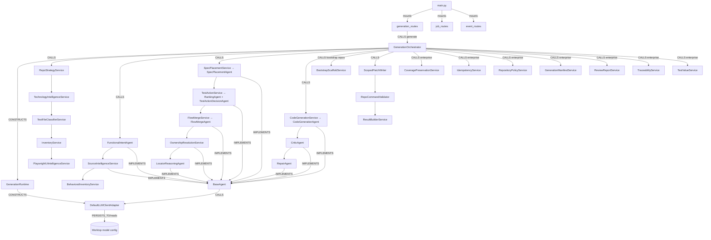

# 01 — Backend Code Dependency Graph (test-agent)

Typed graph of the test-agent backend (`worktop/test_agent/app`). Legend in
[README](README.md). Root prefix `worktop.test_agent.app` omitted from names.

## Layered graph



## Typed edges — API & runtime

| From | Edge | To | Notes |
|---|---|---|---|
| `main.py` | IMPORTS/mounts | `generation_routes`, `job_routes`, `event_routes` | prefix `/api/playwright` |
| `generation_routes` | CALLS | `GenerationOrchestrator().generate(request)` | **synchronous**, inline pipeline |
| `GenerationOrchestrator` | CONSTRUCTS | `GenerationRuntime.from_request(request, db)` | per request |
| `GenerationRuntime` | CONSTRUCTS | `LLMClientFactory.create(db, tenant_id)` → `DefaultLLMClientAdapter` | requires tenant_id |

## Typed edges — pipeline stages (in order)

| Stage service/agent | Edge | Produces (DTO) |
|---|---|---|
| `RepoStrategyService` | CALLS scanners | `RepoProfile` (support/bootstrap) |
| `TechnologyIntelligenceService` | CALLS | technology profile |
| `TestFileClassifierService` → `InventoryService` | CALLS | `RepositoryInventory` |
| `PlaywrightUiIntelligenceService` | CALLS | `PlaywrightUiContext` |
| `FunctionalIntentAgent` | LLM | `FunctionalIntent` |
| `SourceIntelligenceService` | LLM | `SourceIntelligence` |
| `BehavioralInventoryService` | parse | `BehavioralTestUnit[]` |
| `SpecPlacementService` (exploration loop) | LLM+tools | `SpecPlacementDecision` |
| `TestActionService` (ranking + decision) | LLM+tools | `TestActionDecision` |
| `FlowMergeService` | LLM | `FlowMergePlan` |
| `OwnershipResolutionService` | LLM | `OwnershipResolution` |
| `LocatorReasoningAgent` | LLM | `LocatorDecisionSet` |
| `CodeGenerationService` (exploration loop) | LLM+tools | `PatchSet` |
| `CriticAgent` → `RepairAgent` | LLM | reviewed/repaired `PatchSet` |
| `BootstrapScaffoldService` | deterministic | scaffold `PatchSet` (bootstrap repos) |
| `ScopedPatchWriter` | CALLS `patching/*` | applied patches + diff |
| `RepoCommandValidator` | CALLS `validation/*` | `ValidationResult` |
| `ResultBuilderService` | assemble | `GenerationResult` |

## Typed edges — deterministic guards & healing (the safety net)

| Guard/loop | In | Effect |
|---|---|---|
| patch-plan guard (`_patch_plan_check`) | orchestrator | extension target, preserved steps, append reuse, reference integrity, ownership emission, created-spec structure, bootstrap scaffold |
| reconcile + confidence gates | orchestrator | coerce action to placement; low-confidence → safe fallback + `review_reasons` |
| guard-repair + validation-repair | orchestrator + `RepairAgent` | bounded autonomous healing |

## Typed edges — exploration (agentic, self-contained)

| From | Edge | To |
|---|---|---|
| `SpecPlacementAgent`, `TestActionDecisionAgent`, `CodeGenerationAgent` | CALLS | `BaseAgent.complete_with_exploration` |
| `BaseAgent.complete_with_exploration` | CALLS | `tools/repo_explorer_tool.RepoExplorer` (read_file/search/list_dir) |
| exploration turns | ACCEPTS/RETURNS | `SpecPlacementTurn` / `TestActionTurn` / `PatchSetTurn` (`schemas/exploration`) |

## PERSISTS_TO / EXTERNAL edges

| From | Edge | To |
|---|---|---|
| `DefaultLLMClientAdapter` | PERSISTS_TO (read) | Worktop model config by `tenant_id` — **only DB access** |
| all modules | DEPENDS_ON | `logging_config` → Worktop custom logger |

No `ENTITY`/`TABLE` nodes. Generated specs are written to the workspace on disk
via `patching/scoped_patch_writer` (+ `backup_manager`), not a database.

## TESTED_BY

| Area | Test |
|---|---|
| structured-output hardening, exploration, guards, ranking, flow reuse, bootstrap | `tests/test_structured_output_hardening.py` |
| enterprise gaps (coverage, policy, manifest, review, traceability, value, idempotency) | `tests/test_enterprise_gaps.py` |
| logging standard | `tests/test_logging_standard.py` |

## Module dependencies

```text
api → services/generation_orchestrator → agents → prompts + tools + patching + validation + inventory + adapters
services → schemas (DTOs, decision_trace, exploration)
agents → llm (DefaultLLMClientAdapter) → EXTERNAL worktop
all → logging_config, config, errors
```
