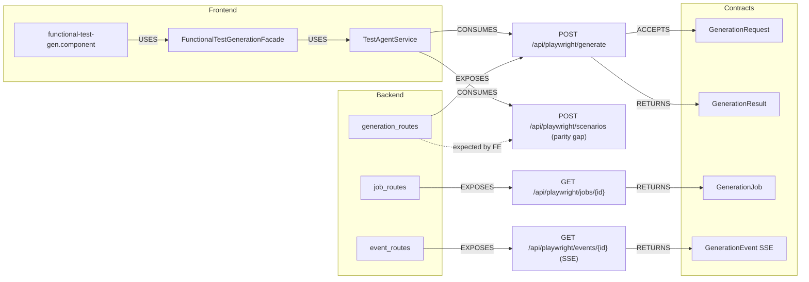

# 02 — Cross-Layer Contract Propagation Graph (test-agent)

Backend endpoint → contract DTO → frontend service → model → screen, for the
test-agent surface (`/api/playwright`) and its **functional-test-gen** frontend
consumer.

## Endpoint contract table

| Endpoint | Method | ACCEPTS | RETURNS | Frontend consumer |
|---|---|---|---|---|
| `/api/playwright/generate` | POST | `GenerationRequest` | `GenerationResult` | `TestAgentService.generateCode()` |
| `/api/playwright/scenarios` | POST | (functional scenarios request) | `FunctionalTestCase[]` | `TestAgentService.generateScenarios()` |
| `/api/playwright/jobs/{job_id}` | GET | — | `GenerationJob` | (job polling) |
| `/api/playwright/events/{job_id}` | GET (SSE) | — | `GenerationEvent` | (progress) |

> **Parity gap (action item):** the frontend `TestAgentService` calls
> `POST /api/playwright/scenarios` and `POST /api/playwright/generate`, but the
> backend `generation_routes` currently exposes only `/generate` (+ job/event
> routes). Add/confirm the `/scenarios` route before wiring the real
> (non-mock) service. Same note as `../16-...` in api-agent docs.

## Contract propagation (backend DTO → frontend model)

| Backend DTO | MAPS_TO frontend model | Used by screen |
|---|---|---|
| `GenerationResult` (files_changed, diff, validation, needs_review, review_reasons) | `FunctionalGenerationResult` (`functional-test-generation.model.ts`) | result panel |
| scenario output | `FunctionalTestCase[]` | functional test-case list |
| `GenerationRequest` | `GenerateFunctionalCodeRequest` | facade generateCode |
| scenarios request | `GenerateFunctionalScenariosRequest` | facade generateScenarios |
| `GenerationEvent {stage,message}` | facade progress signals | progress UI |

## Non-REST contracts

| Kind | Contract | Direction |
|---|---|---|
| SSE | `GenerationEvent` over `GET /api/playwright/events/{id}` | backend → frontend |

No GraphQL/WebSocket/Kafka contracts today.

## Impact-analysis usage

- Change `GenerationResult` shape → update `FunctionalGenerationResult` TS
  interface (status union, validation object) and the result panel binding.
  (This is exactly the mismatch the CI typecheck caught earlier — `status`
  widening to `string`.)
- Add `/scenarios` backend route → the frontend service edge already exists;
  only the backend node is missing.
