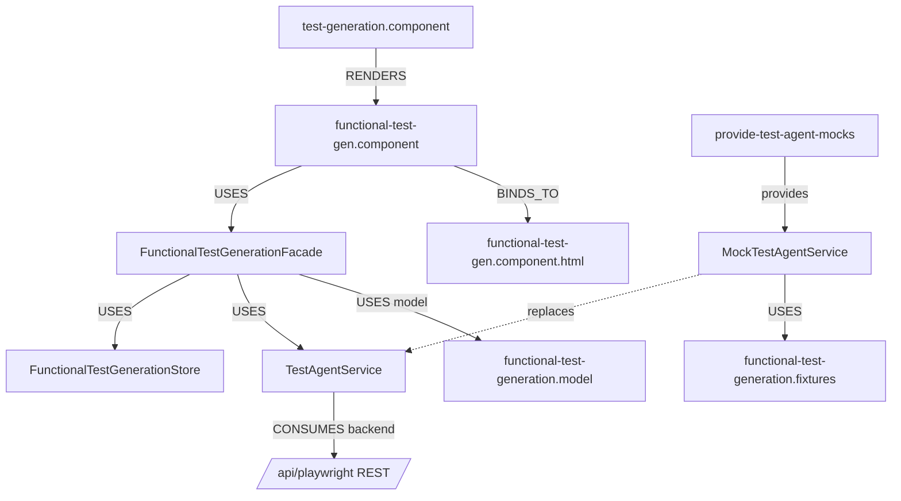

# 03 — Frontend Code Dependency Graph (test-agent / functional tab)

Angular dependency graph for the **functional-test-gen** tab, which consumes
test-agent (`/api/playwright`). These files live under
`api-agent/frontend/test-generation/functional-test-gen/` (shared frontend tree)
but are graphed here because they belong to test-agent's contract.

## Typed edges

| From | Edge | To |
|---|---|---|
| `test-generation.component` | RENDERS | `functional-test-gen.component` (tab) |
| `functional-test-gen.component` | USES | `FunctionalTestGenerationFacade` |
| `functional-test-gen.component` | BINDS_TO | `functional-test-gen.component.html` |
| `FunctionalTestGenerationFacade` | USES | `FunctionalTestGenerationStore` (signals) |
| `FunctionalTestGenerationFacade` | USES | `TestAgentService` |
| `TestAgentService` | CONSUMES | `POST /api/playwright/scenarios`, `POST /api/playwright/generate` |
| facade / component | USES model | `functional-test-generation.model.ts` |

## Model nodes

| Model (`functional-test-generation.model.ts`) | Role |
|---|---|
| `FunctionalTestCase` | scenario row |
| `FunctionalGenerationResult` | code-gen result (status union `completed\|needs_review\|failed`, validation, needsReview) |
| `GenerateFunctionalScenariosRequest` | scenarios request payload |
| `GenerateFunctionalCodeRequest` | code request payload |

> The `status` field is a **string-literal union**, not `string` — the CI
> typecheck failure earlier was exactly a `MAPS_TO` violation (mock literal
> widening `status` to `string`). This graph edge is why that broke.

## Mock / DI seam

| From | Edge | To |
|---|---|---|
| `provide-test-agent-mocks` | provides (DI) | `MockTestAgentService` |
| `MockTestAgentService` | replaces | `TestAgentService` (transport only) |
| `MockTestAgentService` | USES | `functional-test-generation.fixtures` |

Swapping preview → real backend = remove `provideTestAgentMocks()` from the host
`ApplicationConfig`; `TestAgentService` (HttpClient) takes over unchanged.

## TESTED_BY

No `.spec.ts` in this tree yet; contract fidelity is enforced by test-agent's
backend suites and the mock mirroring the real DTOs. The `Flow → COVERED_BY →
e2e` layer (Playwright over the functional tab) is a natural addition.

## Cross-reference

The API-test tab in the same tree consumes **api-agent** (`/api/api-test-generation`)
and is graphed in `api-agent/technical-architecture/dependency-graphs/03`.
